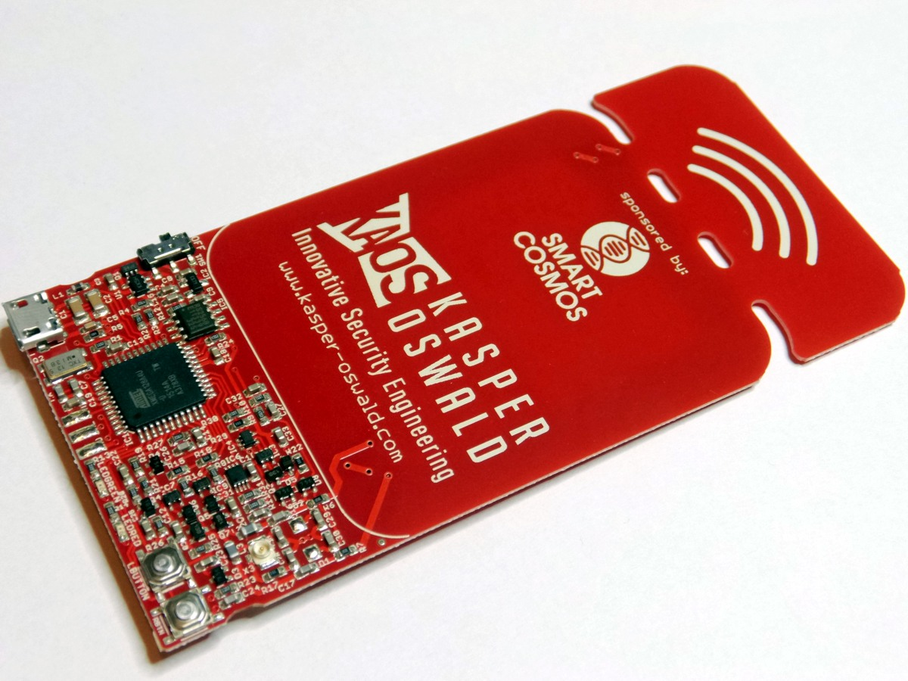
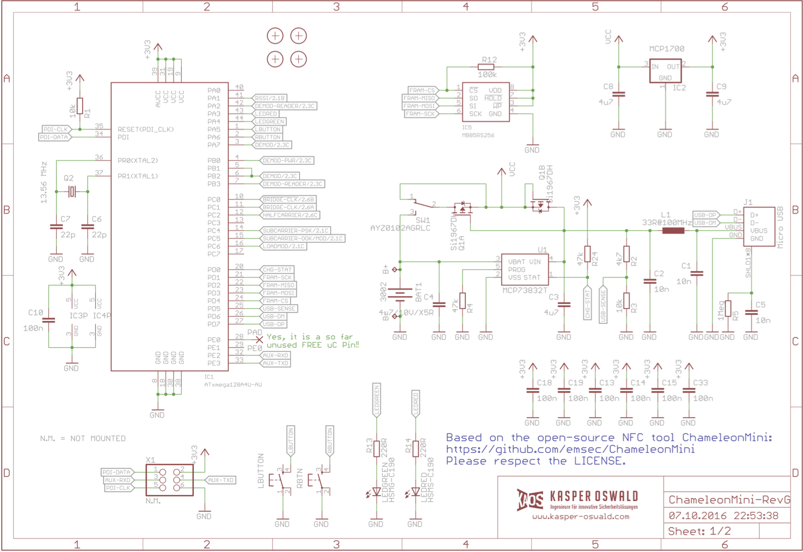
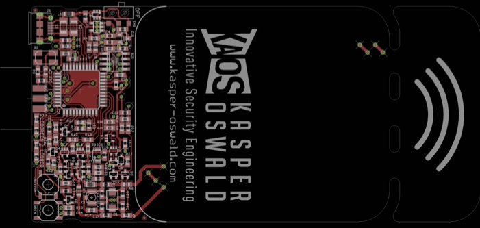
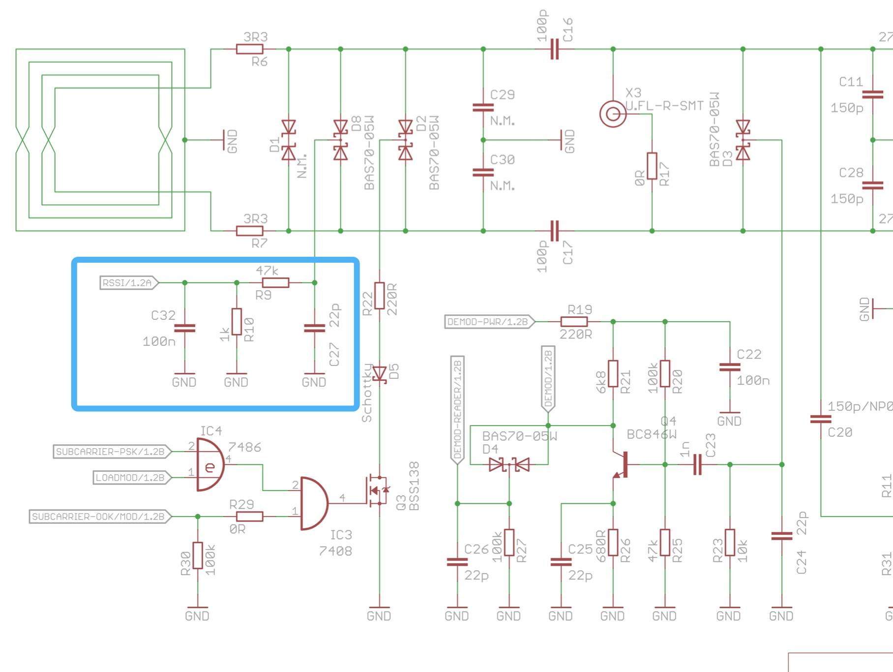

## 变色龙ChameleonMini
  ChameleonMini是一种用于NFC安全分析的可自由编程的便携式工具，可以模拟和克隆非接触式卡、读取 RFID 标签和嗅探/记录RF信号。
  github--https://github.com/AndreasBujok/ChameleonMini

  

## 安全解析
根据开源方案设计了开源硬件变色龙，用来做IC卡嗅探、存储、复制，在调试过程中发现模拟功能正常，读取一直存在问题，咨询了国内曾经设计过变色龙的够工程也存在同样问题，深入研究后发现开源方案中存在核心参数标示错误的情况，记录位置如下。所以不能对开源方案要求太多，估计是开发者有意抬高研究门槛，提高产品销量。

## 修复方案
开源方案中读取硬件核心参数标示错误，调整此处C32、R10参数即可。

