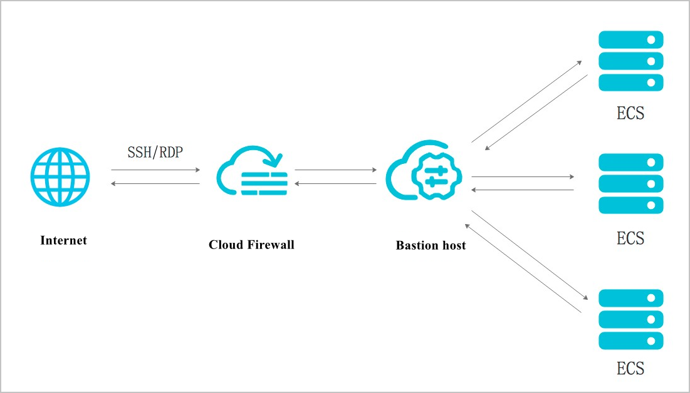

## 堡垒机安全加固方案（书籍草稿）

	Jumpserver 对外需要开放 80 443 和 2222 端口
	JumpServer 所在服务器操作系统应该升级到最新
	JumpServer 依赖的软件升级到最新版本
	服务器、数据库、redis 等依赖组件请勿使用弱口令密码
	不推荐关闭 firewalld 和 selinux
	只开放必要的端口，必要的话请通过 vpn 或者 sslvpn 访问 JumpServer
	如果必须开放到外网使用，你应该部署 web 应用防火墙做安全过滤
	请部署 ssl 证书通过 https 协议来访问 JumpServer
	JumpServer 不要使用弱口令密码，应立即改掉默认的 admin 密码
	推荐开启 MFA 功能，避免因密码泄露导致的安全问题

