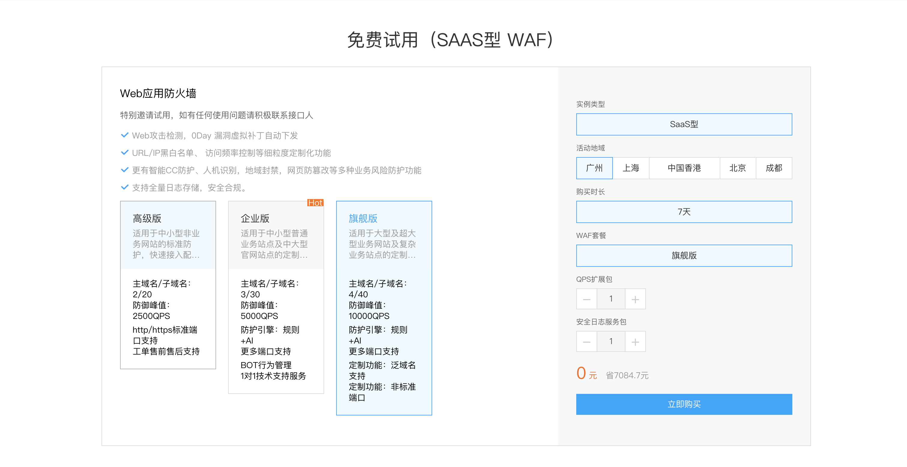
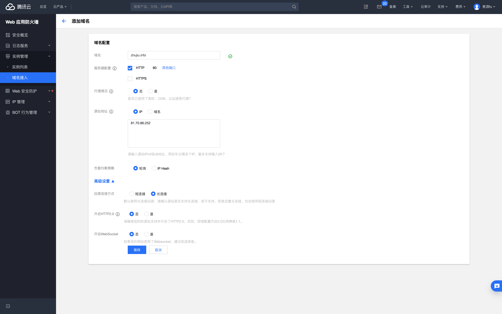
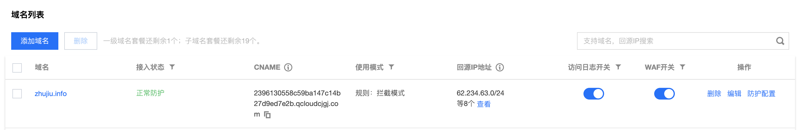
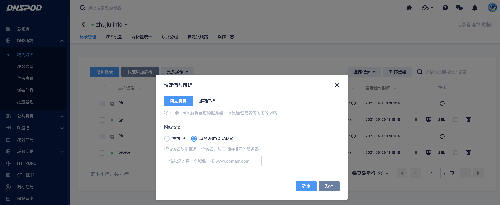
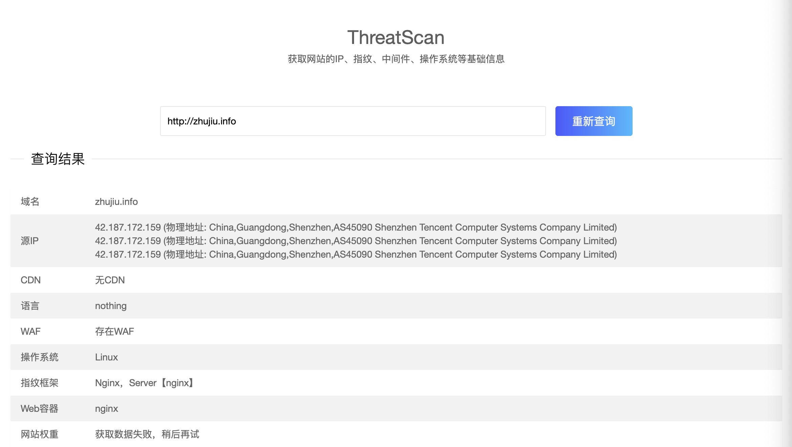
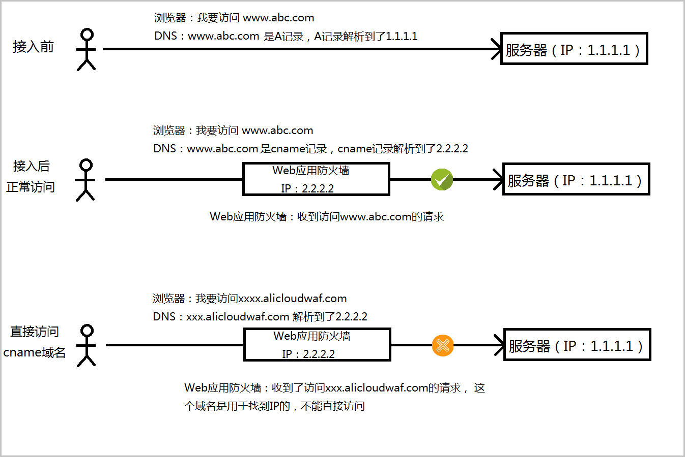
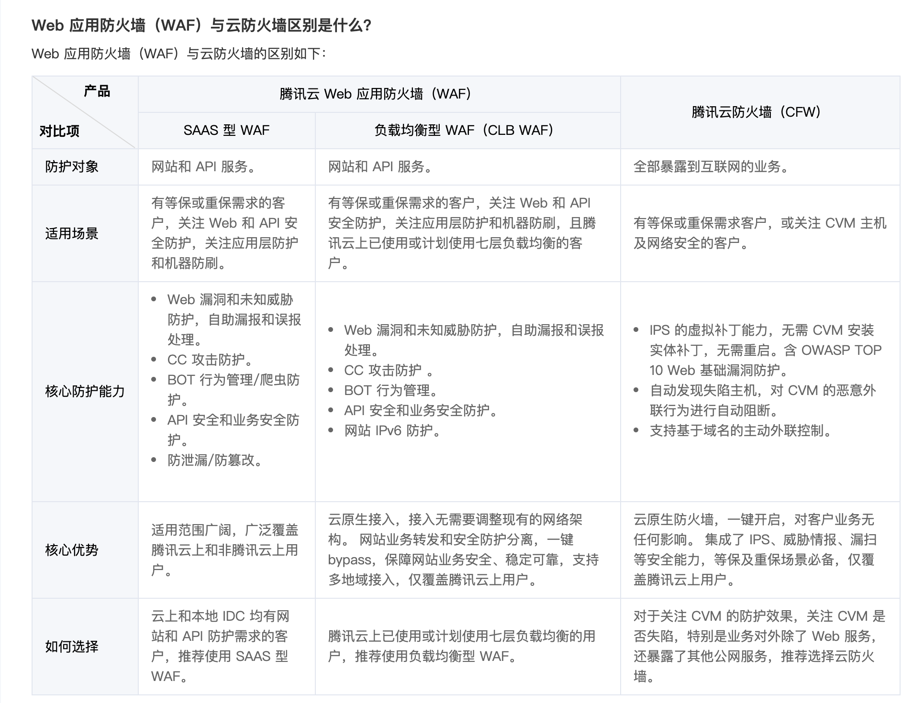

## WAF防火墙CNAME配置方法

各大安全厂商部署Cname防火墙方式基本相同，同时Web应用防火墙也支持防护HTTPS业务，用户通过Web应用防火墙界面配置前端HTTPS协议，并托管证书之后，Web应用防火墙可以防护HTTPS的流量。
以腾讯WEB应用防火墙配置方法举例：

1、购买WEB应用防火墙使用版本（7天免费试用）
https://cloud.tencent.com/act/pro/clbwafenterprise#BUY

2、接入防护网站域名
https://console.cloud.tencent.com/guanjia/instance/domain/add

配置成功后，自动下发CNAME
 

3、配置CNAME，将CNAME复制至域名映射
https://console.dnspod.cn/dns/zhujiu.info/record?source=cloud
 

4、域名映射完成后，WEB防火墙开始生效，进行在线域名安全检测
 

5、 Cname安全防护原理图示

6、云防火墙与主机防火墙区别
云防火墙：保护全部暴露到互联网的业--https://cloud.tencent.com/document/product/627/49670

